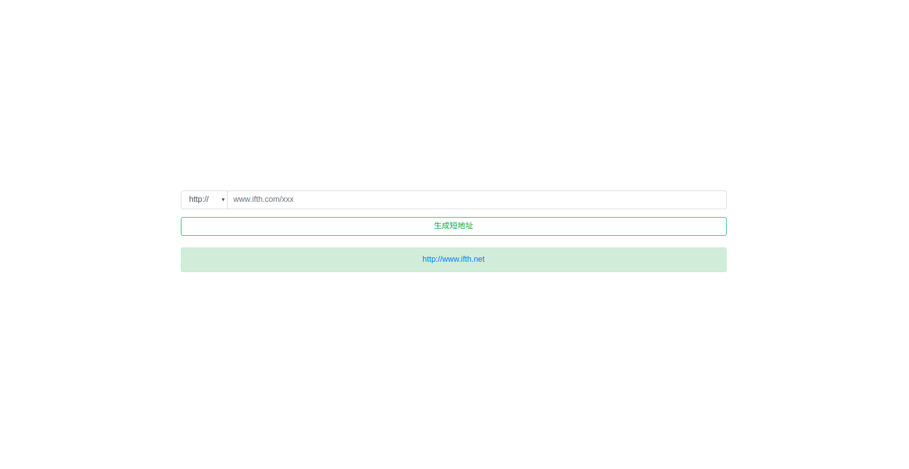

[](https://travis-ci.org/WindGreen/ifth)

# Short Url Service

This is a service to generate short url for long url.

[中文文档](README_zh-cn.md)

Demo：http://www.ifth.net



## Features

- Web page to generate short url
  - Choosing http/https
  - Choosing length (developing)
  - Custom ID (Scheduling)
- API to generate short url(developing)
  - Length input


## Installation

### Build

Service is depended on MongoDB, please install first. [Mongo Installation](https://docs.mongodb.com/manual/installation/)

- Web page

  ```shell
  go get github.com/WindGreen/ifth
  cd www
  dep ensure
  chmod +x url && ./url
  ```

  this will listen the default port:8080, to change it by [Configuration](#Configuration)

- Url Service

  ```shell
  go get github.com/WindGreen/ifth
  cd url
  dep ensure
  chmod +x www && ./www
  ```

  this will listen the default port:80, to change it by [Configuration](#Configuration)

### Docker

- Web page

  ```shell
  docker network create ifth
  docker run -d --name mongo --network ifth mongo
  docker run -d -p 80:80 --network ifth yqfwind/ifth-www:1.0.0
  ```

- Url Service

  ```shell
  docker network create ifth
  docker run -d --name mongo --network ifth mongo
  docker run -d -p 80:80 --network ifth yqfwind/ifth-url:1.0.0
  ```

  

## Configuration

- Web page

```yaml
mongodb:
  host: localhost
# www service
www:
  home: http://localhost:8080
  port: 8080
# url service
url:
  base: http://localhost/%s
  length: 3
  unique: true
```

**www.home**: the web page url

**www.port**: the web service listened on

**url.base**: the short url refers to, %s is the slot

**url.length**: the slot length

**url.unique**: TRUE or FALSE. FALSE means  one url can has many short url linked to it.


- Url Service

```yaml
mongodb:
  host: localhost
# www service
www:
  home: http://localhost:8080
# url service
url:
  base: http://localhost/%s
  port: 80
```

**url.port**: the url service listened on

