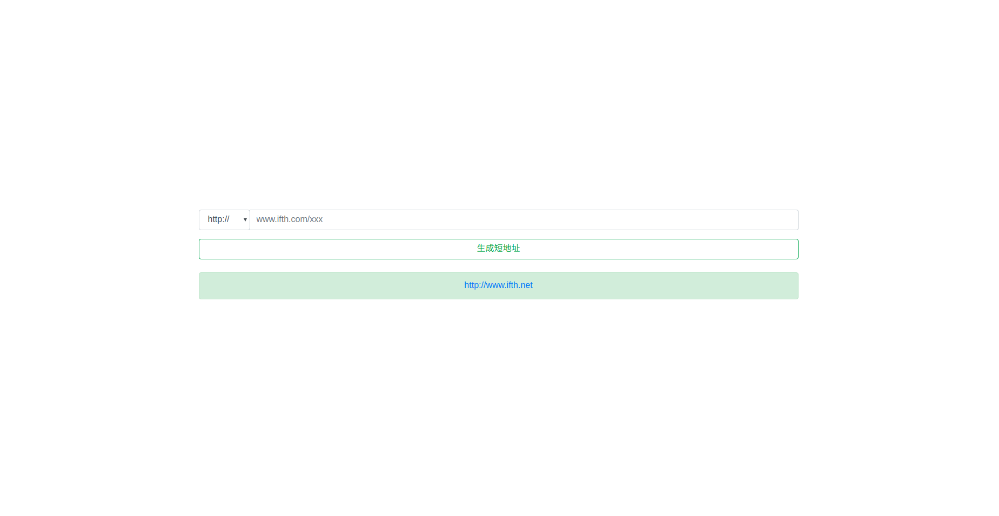

[](https://travis-ci.org/WindGreen/ifth)

# 短链接服务

这是一个提供短链接和短地址的服务，可以用来给应用生成短地址。

[English Document](README.md)

演示地址：http://www.ifth.net



## 功能

- 提供生成地址的页面
  - 可选http/https
  - 可选长度（开发中）
  - 申请个性化地址（规划中）
- 提供生成地址的接口（开发中）
  - 可指定长度


## 安装

### 编译

本程序依赖MongoDB，请先安装mongoDB

- 网站服务

  ```shell
  go get github.com/WindGreen/ifth
  cd www
  dep ensure
  chmod +x url && ./url
  ```

  默认监听8080端口，通过 [配置](#配置)更改

- 短链接服务

  ```shell
  go get github.com/WindGreen/ifth
  cd url
  dep ensure
  chmod +x www && ./www
  ```

  默认监听80端口，通过 [配置](#配置)更改

### Docker

- 网站服务

  ```shell
  docker network create ifth
  docker run -d --name mongo --network ifth mongo
  docker run -d -p 80:80 --network ifth yqfwind/ifth-www:1.0.0
  ```

- 短链接服务

  ```shell
  docker network create ifth
  docker run -d --name mongo --network ifth mongo
  docker run -d -p 80:80 --network ifth yqfwind/ifth-url:1.0.0
  ```

  

## 配置

- 网站服务

```yaml
mongodb:
  host: localhost
# www service
www:
  home: http://localhost:8080
  port: 8080
# url service
url:
  base: http://localhost/%s
  length: 3
  unique: true
```

**www.home**: 网站首页

**www.port**: 网站的端口

**url.base**: 短链接的地址，%s表示短链接ID

**url.length**: 短链接ID长度

**url.unique**: TRUE or FALSE. FALSE 意味着一个长地址可以有多个短地址与之对应


- 短地址服务

```yaml
mongodb:
  host: localhost
# www service
www:
  home: http://localhost:8080
# url service
url:
  base: http://localhost/%s
  port: 80
```

**url.port**: 短地址服务监听的端口

